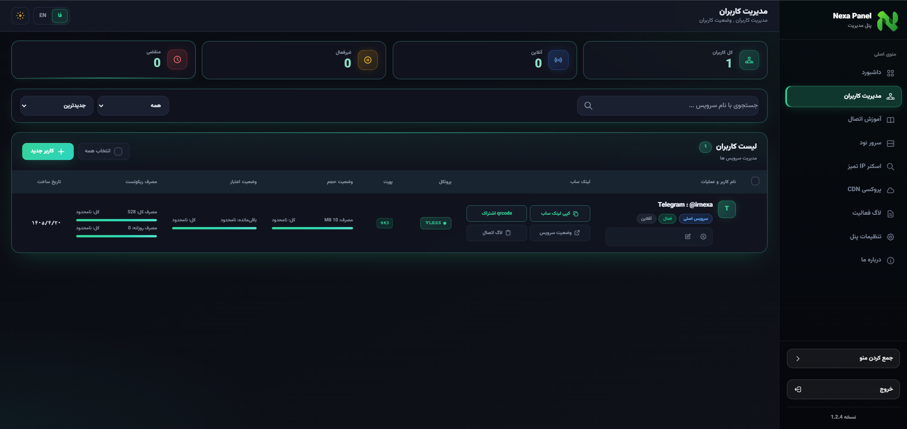
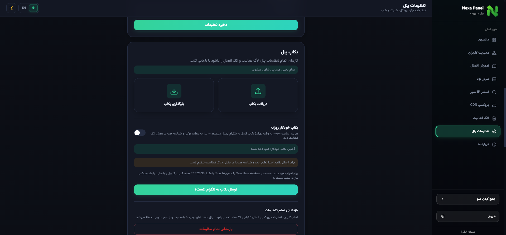

<div align="center">

# 🚀 NEXA Panel

### پنل مدیریتی سبک، سریع و رایگان روی Cloudflare Workers

[](https://opensource.org/licenses/MIT)
[](https://workers.cloudflare.com/)
[](https://developers.cloudflare.com/d1/)

## 🔗 لینک های کاربردی

<p align="center">
  <a href="https://www.irnexa.workers.dev/"></a>
  <a href="https://deploy.irnexa.workers.dev"></a>
  <a href="https://farzadqavidel.github.io/nexa-panel/"></a>
  <br><br>
  <a href="https://t.me/irnexa"></a>
  <a href="https://www.youtube.com/@IR_NEXA"></a>
</p>
🇮🇷 **فارسی** &nbsp;|&nbsp; 🇬🇧 [Read in English](README.md)

</div>

---

## 📖 معرفی

**NEXA Panel** یک پنل مدیریتی است که کاملاً روی زیرساخت رایگان **Cloudflare** (Workers + D1 Database) اجرا می‌شود؛ یعنی بدون نیاز به هیچ سرور جداگانه‌ای می‌توانید نسخه‌ی اختصاصی خودتان را در چند دقیقه بالا بیاورید.

## 🖼️ تصاویر پنل


<p align="center">
  <br><br>
  
</p>

## ✨ ویژگی‌ها

- ⚡ استقرار سریع، بدون نیاز به سرور اختصاصی
- 🆓 اجرا روی پلن رایگان Cloudflare Workers و D1
- 🖱️ روش نصب یک‌کلیکی برای کاربران غیر فنی
- 🛠️ روش نصب دستی برای کنترل کامل روی تنظیمات
- ⏰ به‌روزرسانی خودکار با Cron Trigger
- 🧬 ساخت کانفیگ با پروتکل VLESS
- 🔐 پشتیبانی از پورت‌های TLS و None TLS
- 👥 قسمت مدیریت کاربران
- 💾 قسمت بکاپ خودکار و دستی
- 🌐 سیستم پروکسی آی‌پی برای دریافت آی‌پی ثابت (مناسب کارهای حساس مانند ترید و صرافی نیست)
- 🧹 اسکنر آی‌پی تمیز

## 📚 مستندات

راهنمای کامل استفاده از تمام بخش‌های پنل، از نصب تا تنظیمات پیشرفته، در صفحه‌ی مستندات رسمی در دسترس است:

### 👉 [مشاهده‌ی مستندات کامل پنل](https://farzadqavidel.github.io/nexa-panel/)

## 🚀 نصب سریع (روش ساده)

فقط کافیست وارد صفحه‌ی ساخت پنل شوید و مراحل را دنبال کنید؛ پنل شما روی دامنه‌ی رایگان Cloudflare بالا می‌آید:

### 👉 [رفتن به صفحه ساخت پنل](https://deploy.irnexa.workers.dev)

## 🧩 نصب دستی

اگر ترجیح می‌دهید پنل را قدم‌به‌قدم و با کنترل کامل خودتان راه‌اندازی کنید:

1. **دانلود اسکریپت**
   فایل اسکریپت پنل نکسا را دانلود کنید.

2. **ساخت Worker و آپلود کد**
   یک Worker جدید در Cloudflare بسازید و کد دانلودشده را روی آن آپلود کنید.

3. **ساخت D1 و بایند کردن**
   یک D1 Database بسازید و آن را با نام `DB` به Worker خودتان بایند کنید.

4. **تنظیم متغیر محیطی**
   متغیر محیطی `CF_API_TOKEN` را در تنظیمات Worker وارد کنید.

5. **تنظیم Cron Trigger**
   یک Cron Trigger با مقدار زیر برای Worker تنظیم کنید:

   ```
   30 20 * * *
   ```

## 💖 حمایت مالی

اگر این پروژه برایتان مفید بوده، می‌توانید با ارسال رمزارز از پروژه حمایت کنید 🙏

| ارز | آدرس کیف پول |
|---|---|
| USDT (ERC20) | `0x78684D142CfD0dF27Cea2b2f62d98aBa0D4bc288` |
| TON (GRAM) | `UQBk2fhFpLgktSVucFgXdsjqNDHzHv-0GRlbN2jplnz94GZh` |
| BTC | `bc1qzzekk7y5fpzndywzk2jhmd8vv4wd7sdrq5csvu` |

## 📄 لایسنس

این پروژه تحت لایسنس **MIT** منتشر شده است. برای جزئیات بیشتر فایل [LICENSE](LICENSE) یا صفحه‌ی رسمی [MIT License](https://opensource.org/licenses/MIT) را ببینید.

---

<div align="center">

ساخته شده توسط **NEXA**

</div>